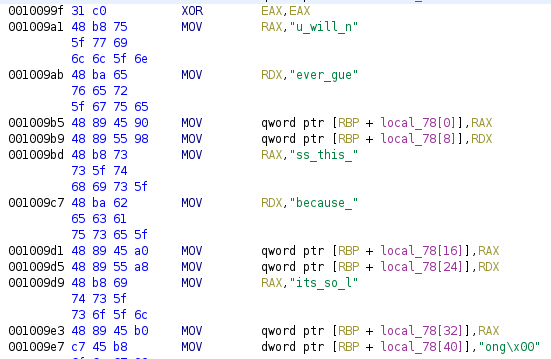
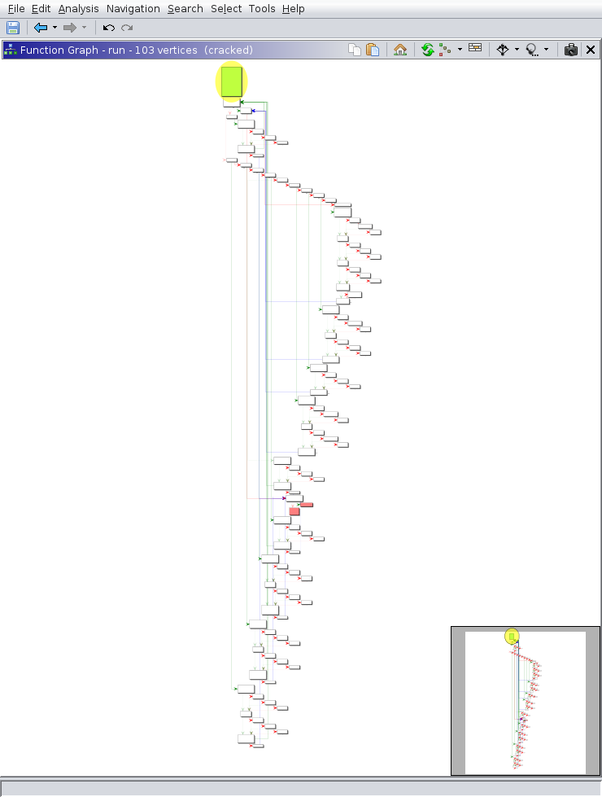
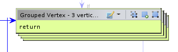
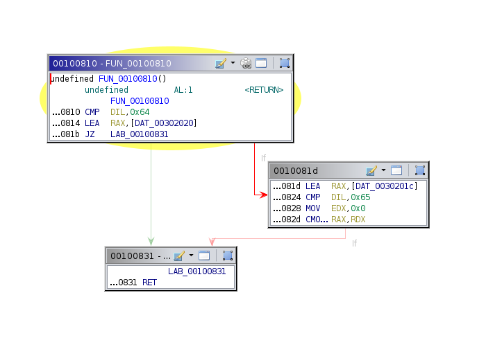
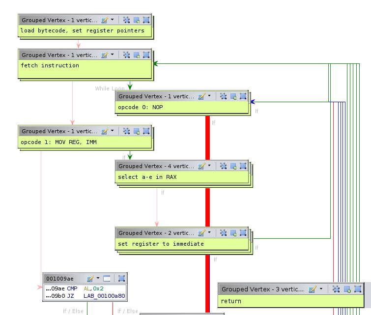
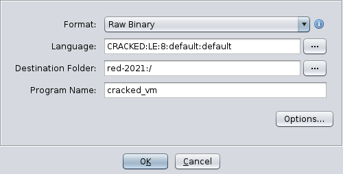

Solutions for rev challenges from the CSAW RED 2020 Qualification Round.

Some of the scripts in this document have been clipped for the sake of brevity.

# rev - concrete_trap
> I put my valuables behind a perfect knowledge lock. Don't bother. `nc rev.red.csaw.io 5002`

## Files
- concrete_trap

## Solution
```c
int main(void)

{
  int i;

  init();
  puts("Welcome to my intricate trap, where all who are not me shall fail.");
  i = stage1();
  if (i == 0) {
    fail();
  }
  puts("I am slightly convinced you are me. Proceed.");
  i = stage2();
  if (i == 0) {
    fail();
  }
  puts("There are only a couple bazillion pairs of numbers I like. You might be me.");
  i = stage3();
  if (i == 0) {
    fail();
  }
  puts("Amazing");
  give_flag();
  return 0;
}
```

All we need to do is pass each stage. Stage 1 is relatively simple - it is simply an inlined `strcpy()` followed by a `strcmp()`. We can get the correct string with a debugger or by using Ghidra's `Convert` feature.



```
Stage 1: u_will_never_guess_this_because_its_so_long
```

Stage 2 involves a short function.

```c
bool stage2(void)

{
  bool ret;
  int x;
  int y;
  int a;
  int b;

  x = 0;
  y = 0;
  puts("What are my two numbers?");
  scanf("%d %d",&x,&y);
  if ((x < 0x32) || (y < 0x32)) {
    ret = false;
  }
  else {
    a = x;
    b = y;
    while (0x0 < b) {
      a = a ^ y + x * b;
      b = b - 1;
    }
    ret = a == 0x7a69;
  }
  return ret;
}
```

This is simple enough that we can just brute force it until we get a good pair of numbers. Feel free to do some mathematical analysis on your own.

```python
def try_stage2(x, y):
  a, b = x, y
  while 0 < b:
    a = a^y + x*b
    b -= 1
  return a & 0xffffffff

def stage2():
  for x in range(0x32, 0xffffffff):
    if try_stage2(x, 0x33) == 0x7a69:
      return x
      break
```

```
Stage 2: 16690 51
```

Stage 3 is much more complex.

```c
bool stage3(void)

{
  char a;
  char b;
  int v;
  int w;
  int x;
  int y;
  int z;
  int i;
  long local_10;

  puts("Even I haven\'t figured this one out yet");
  scanf("%d %d %d %d %d",&v,&w,&x,&y,&z);
  i = 0x0;
  while (i < 0x5) {
    a = (char)y;
    v = w >> ((char)x + a * (char)v & 0x1fU);
    b = (char)z;
    w = y << (b - a * (char)v & 0x1fU);
    x = z >> ((char)v + (char)x * (char)w & 0x1fU);
    y = w << ((char)x - a * b & 0x1fU);
    z = x >> ((char)y + (char)w * b & 0x1fU);
    i = i + 0x1;
  }
  return z + v + w + x + y == 0x7a69;
}
```

This is much too big to brute force. Instead, we'll use symbolic execution with [angr](https://angr.io/).

```python
import angr

proj = angr.Project("./concrete_trap", main_opts={'base_addr': 0x400000})
state = proj.factory.entry_state(addr=0x400b8c)
v = state.solver.BVS('v', 32)
w = state.solver.BVS('w', 32)
x = state.solver.BVS('x', 32)
y = state.solver.BVS('y', 32)
z = state.solver.BVS('z', 32)
state.memory.store(state.regs.rbp-0x20, v)
state.memory.store(state.regs.rbp-0x1c, w)
state.memory.store(state.regs.rbp-0x18, x)
state.memory.store(state.regs.rbp-0x14, y)
state.memory.store(state.regs.rbp-0x10, z)

sm = proj.factory.simulation_manager(state)
sm.explore(find=0x400c4a, avoid=0x400c51)

def stage3():
  if sm.found:
    state = sm.found[0]
    print(state.solver.eval(v.reversed), state.solver.eval(w.reversed), state.solver.eval(x.reversed), state.solver.eval(y.reversed), state.solver.eval(z.reversed))
```

```
Stage 3: 14 6144 29 2053472513 1344348227
```

Submitting all three stages gives us the flag.

## Flag
```
flag{symb0l1c_v1ct0r13s_4r3_jUst_4s_g00d}
```

# rev - Proprietary
> Greetings, employee #9458. Please ensure that our DRM software is sufficiently secure.
>
> `nc rev.red.csaw.io 5004`

## Files
- proprietary

## Solution
There is an inlined `strcpy()` followed by a `strcmp()`. There are a few operations done on this string before the compare but notice that our input is not changed or referenced in the calculation.

```c
local_28 = 0x7075737265707573;
local_20 = 0x7372657075737265;
local_18 = 0x6d72647465726365;
local_10 = 0x0;
local_48 = 0x756c656572666f6e;
local_40 = 0x726f2d736568636e;
local_38 = 0x6572617774666f73;
local_30 = 0x0;
local_68 = 0x6967657361656c70;
local_60 = 0x79656e6e756d6576;
local_58 = 0x7369646573756f74;
local_50 = 0x0;
local_c = 0x0;
while (local_c < 0x19) {
local_88[(int)local_c] =
     *(byte *)((long)&local_28 + (long)(int)local_c) ^
     *(byte *)((long)&local_48 + (long)(int)local_c);
local_88[(int)local_c] =
     local_88[(int)local_c] ^ *(byte *)((long)&local_68 + (long)(int)local_c);
local_c = local_c + 0x1;
}
iVar1 = strcmp(param_1,(char *)local_88);
return iVar1 == 0x0;
```

Therefore, we don't need to do any reversing and can just grab the correct value out of a debugger.

```
strcmp@plt (
   $rdi = 0x00007fffffffda60 → "kitkat<3\n",
   $rsi = 0x00007fffffffd9d0 → "mvsvds~l}tvem&xxbcabfai{",
   $rdx = 0x00007fffffffd9d0 → "mvsvds~l}tvem&xxbcabfai{"
)
───────────────────────────────────────────────────────────────────────────────────────── threads ────
[#0] Id 1, Name: "proprietary", stopped 0x555555555275 in trademark (), reason: BREAKPOINT
```

Sending `mvsvds~l}tvem&xxbcabfai{` to the server gives the flag.

## Flag
```
flag{fr3e_n_0p1n_so@rce_xd}
```

# rev - Recursive
> Onions have layers. Recursions have layers.
>
> `nc rev.red.csaw.io 5000`

## Files
- recursive

```c
  puts("Enter a number from 1 to 99999:");
  fgets(buf, 0x6, stdin);
  input = atoi(buf);
  if (0x0 < input) {
    x = f(input, &i);
  }
  if ((i == 0x7) && (x + 0x7 == 0x18 - 0x6)) {
    flag = fopen("flag.txt","r");
    fgets(flagbuf, 0x18, flag);
    puts(flagbuf);
  }
```

Okay, so we'd like `f()` to return 11. We just need to see what `f()` does to `i`.

```c
int f(int x, int *i)
{
  if ((x & 0x1U) == 0x0) {
    *i = *i + 0x1;
    x = f(x / 0x2, i);
  }
  return x;
}
```

This function checks if `x` is even. If it is, it will divide it by 2 and recurse, incrementing `i`. Otherwise, it will simply return x. Therefore, if we want `i` to be 7, we must have 7 factors of 2. Since we want the return value to be 11, our value must be 2^7 * 11.

Sending 1408 gives us the flag.

## Flag
```
flag{r3Curs1Ve_Rev3rSe}
```

# rev - spaghetti
> Due to technical difficulties, we can only give you the source our intern wrote. We told them to ensure they were using secure coding standards, but they ended up with this... `nc rev.red.csaw.io 5001`

## Files
- spaghetti.c

## Solution
We see many macros at the top, then the bulk of the code is just a bunch of `eeeeee`.

```c
#define eeeeeeeeeeeeeeeeeeeeeeeeeeeeeeeeeeeeeeeeeeeeeeeeeeeeee !
#define eeeeeeeeeeeeeeeeeeeeeeeeeeeeeeeeeeeeeeeeeeeeeeeeeeeeeeeee "%s"
#define eeeeeeeeeeeeeeeeeeeeeeeeeeeeeeeeeeeeeeeeeeeeeeeeeeeeeeeeeee "%s\n"
#define eeeeeeeeeeeeeeeeeeeeeeeeeeeeeeeeeeeee "0"
#define eeeeeeeeeeeeeeeeeeeeeeeeeeeeeeeeeeeeee "2"
#define eeeeeeeeeeeeeeeeeeeeeeeeeeeeeeeee "=a"
#define eeeeeeeeeeeeeeeeeeeeeeeeeeeeeeeeee "=b"
#define eeeeeeeeeeeeeeeeeeeeeeeeeeeeeeeeeee "=c"
#define eeeeeeeeeeeeeeeeeeeeeeeeeeeeeeeeeeee "=d"
#define eeeeeeeeeeeeeeeeeeeeeeeeeeeeeee "cpuid"
#define eeeeeeeeeeeeeeeeeeeeeeeeeeeeeeeeeeeeeeeeeeeeeeeeeee "flag.txt"
#define eeeeeeeeeeeeeeeeeeeeeeeeeeeeeeeeeeeeeeeeeeeeeeeeeeee "r"
#define e #
```

To expand these macros, we can use `gcc -E`. We don't care about most of this, but we can take the important functions and run them through a C formatter.

```c
#include <stdio.h>
#include <stdlib.h>
#include <stdint.h>
#include <string.h>
#include <unistd.h>

#define BUF_SIZE 2048

static inline void wrapper(uint32_t * eax, uint32_t * ebx, uint32_t * ecx, uint32_t * edx) {
  asm volatile("cpuid": "=a"( * eax), "=b"( * ebx), "=c"( * ecx), "=d"( * edx): "0"( * eax), "2"( * ecx));
}

void win(void) {
  FILE * file;
  char buf[255];
  file = fopen("flag.txt", "r");
  if (!file) return;
  fscanf(file, "%s", buf);
  printf("%s\n", buf);
  fclose(file);
}

int main(int argc, char * argv[]) {
  setvbuf(stdout, ((void * ) 0), 2, 0);
  uint32_t eax = 0;
  char input[17];
  fgets(input, sizeof(input), stdin);
  char * buf = malloc(sizeof(char) * 17);
  buf[0] = 'C';
  buf[1] = 'P';
  buf[2] = 'U';
  buf[3] = ':';
  wrapper( & eax, (uint32_t * ) & buf[4], (uint32_t * ) & buf[12], (uint32_t * ) & buf[8]);
  buf[16] = '\0';
  if (strncmp(buf, input, 17) == 0) win();
  free(buf);
  return 0;
}
```

This uses the `cpuid` instruction to get the CPU vendor ID, then compares it to our input. I have an AMD CPU, so the correct answer is `CPU:AuthenticAMD`.

```
$ ./spaghetti
CPU:AuthenticAMD
FLAG
```

We just need to guess what kind of CPU the remote server has. It turns out to be a `GenuineIntel`.

## Flag
```
flag{s0m3b0dy_t0ucha_my_spagh3tt}
```

# rev - parasprite
> This challenge is graciously contributed by Pacific Northwest National Laboratory. To convert their flag to our flag format, replace a string like `"hello world"` with `flag{hello world}` (keeping the space, no underscore) when submitting the flag. If you have any trouble with the flag submission, ping the MailBot on Discord.

## Files
- parasprite

## Solution
The binary is a .NET executable, making decompilation trivial. Use dotPeek or dnSpy for this.

```csharp
public string getFlagText()
{
    return Encoding.UTF8.GetString(Convert.FromBase64String(SeasonOne.Everfree + EpisodeTen.Trixie));
}
```

Easy enough.

```csharp
public static string Everfree = "VGhlIGZsYWcgaXM6ICJVZ2guIE5vdyBJIGdvd";
public static string Trixie = "HRhIGdvIGZpbmQgYSB0cjBtYjBuMyA+Ljwi"
```

Concatenating these two and base64-decoding gives the flag.

## Flag
```
flag{Ugh. Now I gotta go find a tr0mb0n3 >.<}
```

# rev - cracked
> i just want to be happy.

## Files
- cracked

## Solution
Running the binary and sending some input doesn't seem to output anything.

```c
void main(void)
{
  int i;
  void *memory;
  char *ret;

  memory = mmap((void *)0x0,0xc8,0x3,0x22,-0x1,0x0);
  __printf_chk(0x1, "> ");
  fgets((char *)((long)memory + 0x64),0x32,stdin);
  i = run(memory);
  if (i == 0x0) {
    ret = ":(";
  }
  else {
    ret = "yay";
  }
  puts(ret);
  return;
}
```

This starts simple. Our input is written to `memory+100`, we just need `run()` to return 1. Now what does `run()` look like?



Yikes. Note that due to the way this is written (as well as how Ghidra handles switch cases) it is best to ignore the decompilation and focus mainly on the disassembly and function graph.

The first section is relatively simple. All it does is save the argument in R9, then load a bunch of bytes from memory onto the stack. RDX and RDI also point to this stack. Some registers are also set to point to some memory locations.


Next we enter a loop. The first thing it does is call the function at `0x8c0` with arguments `0x4d1, 0`. We could take a look at this function, realize it is a big recursive function, then reimplement it with dynamic programming to obtain the correct return value. However, we should note that the value is simply thrown away - it is stored behind the current array pointer. Therefore, we can patch this out to a simple `return 0`.

If we run the new patched binary, we see that it actually produces output.

```
$ ./cracked_patch
> kitkat<3
:(
```

The next thing the loop does is load the first byte at the stack and compare it to a bunch of different values.


This is a switch case. Lets take a look at what each of these values do. The first one is 0, and is quite simple.


All this does is add 1 to RDX, then loop back to the beginning if RDX is less than RCX. Before we move on to the next jump, lets look at what happens if the jump is not taken.


Ah, so this is where the function returns. We can group these vertices together and label them. Note the return is the value of some memory location; this will be important later.



Now lets look at switch case 1.


First it loads the byte after the 1 into EDI, then compares it to 0x61, 0x62, and 0x63, setting RAX to R8, R10, and R11, respectively. Recall that these are pointers to some memory locations. Note that the byte after this one is loaded into ESI. After this, another function is called that is quite short.



This continues to compare DIL to 0x64 and 0x65, setting RAX to even more memory locations. If DIL is not 0x61-0x65, 0 is returned. We'll label the memory locations that these correspond to, noting that 0x61-0x65 is a-e in ASCII.


Thus, this long sequence simply sets RAX to a-e depending on the second byte after the 1.


The next part of the code just sets the selected memory location to the second byte in ESI, then jumps down to the return if RDX has reached a certain value.


At this point, we start to get an idea for what this binary does. The long string of bytes loaded at the beginning is a custom bytecode, similar to regular assembly. There are only a couple of instructions in this language, and we have just reversed the first two. The memory locations referred to with a-e are our five registers, and RDX acts as a program counter. At the end, the value returned is the value of register d, so it is our goal to make this 1.

Since we're lazy, we can just write an angr script to do this.

```python
import angr
import claripy

start = 0x400e2e
find = 0x400e48
avoid = 0x400e37

p = angr.Project("./cracked_patch")
state = p.factory.entry_state(addr=start)
flag = claripy.BVS("input", 8*37)
for i in range(37):
  state.add_constraints(flag.get_byte(i) != 0)
state.memory.store(state.regs.rdi+100, flag)

sm = p.factory.simulation_manager(state)
sm.explore(find=find, avoid=avoid)

if sm.found:
  print(sm.found[0].solver.eval(flag, cast_to=bytes))
```

Running this for about 10 minutes gives the flag.

But wait! That's lame. In an effort to please the great Jason An, we can continue to reverse the rest of the instructions. We've already done most of the hard work, the rest is just recognizing patterns. So far, we have this:



We can continue for opcode 2. The first thing it does is familiar, but this time it loads two registers instead of 1.


The first register is stored in RBX and the second is in RAX. Then, it moves the value pointed to by RAX into the value pointed to by RBX. This is a simple `mov reg, reg` instruction.

Opcode 3 is a bit different. It again selects two registers, but then does not set their values directly.


The value of the first register is used as an offset from R9, which if you recall from the beginning points to the big mmap chunk. This must be our RAM. Now we understand that addresses are all one byte (which is more than enough to address the 200-byte mmap chunk). This instruction is `mov [reg], reg`. Opcode 4 is very similar; it is `mov reg, [reg]`.

Opcode 5 and 6 are simple; they are `inc reg` and `dec reg`, respectively. Opcode 7 is `imul reg, reg`.

Opcode 8 is `and reg, 0xff`. Recall that everything is one byte, so this is required to make arithmetic and other operations work, since the VM is implemented with x86_64. For the purpose of the bytecode, this is basically a NOP.

Opcode 9 is `xor reg, reg`. The final opcode, number 10, is a bit more complex.


If the first register is 0, it stays 0. Otherwise, the second and third registers are compared and the if they are equal, the first register is set to 1. This must be how comparisons are made and the return value is set.

At this point, we have greatly simplified the function graph.


From here, we can extract the bytecode and write a disassembler. Ghidra actually has an excellent framework for writing custom architectures, using a combination of XML and [Sleigh](https://ghidra.re/courses/languages/html/sleigh.html). I have never used this before, so wanted to take the opportunity to try it out. The code is not very neat, but works pretty nicely.

cracked.ldefs sets some information about the language.
```xml
<?xml version="1.0" encoding="UTF-8"?>

<language_definitions>
  <language processor="CSAW RED 2020 cracked"
            endian="little"
            size="8"
            variant="default"
            version="1.0"
            slafile="cracked.sla"
            processorspec="cracked.pspec"
            id="CRACKED:LE:8:default">
    <description>CSAW RED 2020 cracked</description>
    <compiler name="default" spec="cracked.cspec" id="default"/>
  </language>
</language_definitions>
```

cracked.pspec sets some information about the processor. Note that we set the default  memory block to `ram:0x00` so Ghidra will auto-analyze the beginning of the file.
```xml
<?xml version="1.0" encoding="UTF-8"?>

<processor_spec>
  <programcounter register="PC"/>
  <default_symbols>
    <symbol name="start" address="rom:0x0000" type="code" entry="true"/>
  </default_symbols>
  <default_memory_blocks>
    <memory_block name="ram" start_address="ram:0x00" length="200" mode="rw" initialized="true" />
  </default_memory_blocks>
</processor_spec>
```

cracked.cspec sets some information about the compiler. Note that even though this language does not have a stack (or any branching, for that matter), we still need to point the stack somewhere or else the Ghidra decompiler will crash. We also set the return value to be the D register.
```xml
<?xml version="1.0" encoding="UTF-8"?>

<compiler_spec>
  <global>
    <range space="ram"/>
    <range space="rom"/>
  </global>
  <stackpointer register="fake_sp" space="fake_stack" growth="negative"/>
  <default_proto>
    <prototype name="default" extrapop="unknown" stackshift="0">
      <input></input>
      <output>
        <pentry minsize="1" maxsize="1">
          <register name="D" />
        </pentry>
      </output>
      <unaffected>
        <register name="fake_sp" />
      </unaffected>
    </prototype>
  </default_proto>
</compiler_spec>
```

cracked.slaspec is the important bit. We define some properties, then memory spaces and registers. ROM needs to be 2-byte addressed, or else the bytecode will not fit. Everything else is 1 byte. I've also added an additional RET instruction, which I've borrowed the opcode for from x86. CPS is short for "compare-setz".
```
define endian=little;
define alignment=1;

define space rom type=ram_space size=2 default;
define space ram type=ram_space size=1;
define space register type=register_space size=1;

define space fake_stack type=ram_space size=1 wordsize=1;

define register offset=0 size=1 [ A B C D E fake_sp ];
define register offset=8 size=2 [ PC ];

define token opbyte (8)
  op = (0, 7)
;

define token reg1 (8)
  reg1_1 = (0, 2)
;

define token reg2 (16)
  reg2_1 = (0, 2)
  reg2_2 = (8, 10)
;

define token reg3 (24)
  reg3_1 = (0, 2)
  reg3_2 = (8, 10)
  reg3_3 = (16, 18)
;

define token data8 (8)
  imm8 = (0, 7)
;

attach variables [
  reg1_1
  reg2_1
  reg2_2
  reg3_1
  reg3_2
  reg3_3
] [ _ A B C D E _ _ ];

:NOP is op=0 {
  A=A;
}

:MOV reg1_1, imm8 is op=1; reg1_1; imm8 {
  reg1_1 = imm8;
}

:MOV reg2_1, reg2_2 is op=2; reg2_1 & reg2_2 {
  reg2_1 = reg2_2;
}

:MOV "["^reg2_1^"]", reg2_2 is op=3; reg2_1 & reg2_2 {
  *[ram]:1 reg2_1 = reg2_2;
}

:MOV reg2_1, "["^reg2_2^"]" is op=4; reg2_1 & reg2_2 {
  reg2_1 = *[ram]:1 reg2_2;
}

:INC reg1_1 is op=5; reg1_1 {
  reg1_1 = reg1_1 + 1;
}

:DEC reg1_1 is op=6; reg1_1 {
  reg1_1 = reg1_1 - 1;
}

:MUL reg2_1, reg2_2 is op=7; reg2_1 & reg2_2 {
  reg2_1 = reg2_1 * reg2_2;
}

:AND reg1_1 is op=8; reg1_1 {
  reg1_1 = reg1_1 & 0xff;
}

:XOR reg2_1, reg2_2 is op=9; reg2_1 & reg2_2 {
  reg2_1 = reg2_1 ^ reg2_2;
}

:CPS reg3_1, reg3_2, reg3_3 is op=10; reg3_1 & reg3_2 & reg3_3 {
  reg3_1 = reg3_1 && (reg3_2 == reg3_3);
}

:RET is op=0xc3 {
  return [D];
}
```

After compiling the slaspec and decoding the bytecode to a file, we can open it in Ghidra, selecting our new custom language.



Automatic analysis decompiles some of the function, but not all of it. The problem is that after loading a bunch of bytes, no memory is written, so Ghidra assumes that it is not important and refuses to decompile it. We can use the memory manager in Ghidra to add a single-byte block right after the bytecode with a single return instruction, which tells Ghidra that the value of the D register is important.


Pressing D to disassemble the instruction results in the decompilation being more complete. We see the memory at offset 100 (0x64) being referenced, which is our input. Renaming and retyping as usual gives us the decompilation we're after.


First, a bunch of bytes are loaded into `array`. Then, starting at memory index 0x64 (our input), each byte is multiplied by 3 and XORed with the index, comparing the result to `array`. Keep in mind that all of this is modulo 256, since everything is 1 byte. All we need to do is solve this modular equation for each byte.

```python
chars="""
0x56
0x21
0x45
0x52
0x19
0x2e
0xfa
0x2c
0xc2
0x8
0xf7
0x72
0x48
0xed
0x10
0xea
0x69
0x17
0xe5
0x21
0x24
0x26
0xe6
0x3f
0xef
0x13
0xe7
0x29
0x9d
0x1d
0xde
0x9e
0xbc
0x15
0xc1
0x1e
0xff
""".strip().splitlines()

inv = pow(3, -1, 256)
chars = [int(x, 16) for x in chars]
print(''.join(chr((((i+0x64)^c)*inv)%256) for i, c in enumerate(chars)))
```

Running this gives the flag

## Flag
```
flag{m0m:w3_h4v3_v1rtu4l1z3r_4t_h0m3}
```
