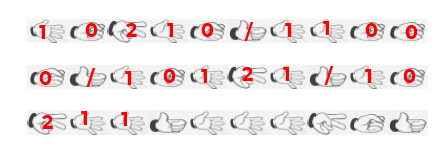

Solutions for crypto challenges from the CSAW RED 2020 Qualification Round.

Some of the scripts in this document have been clipped for the sake of brevity.

# crypto - Caesar, Salad Edition
> Can you crypto a salad?

## Files
- challenge.txt

## Solution
[Caesar cipher, but with numbers](https://planetcalc.com/8572/). Here's a [CyberChef](https://gchq.github.io/CyberChef/#recipe=Substitute('abcdefghijklmnopqrstuvwxyz0123456789','rstuvwxyz0123456789abcdefghijklmnopq')Substitute('ABCDEFGHIJKLMNOPQRSTUVWXY','RSTUVWXYZ0123456789ABCDEF')&input=Vjc2emF0Y2Q0dGMxNzZiLCBoN2QgYXg1dDE2IGMweCAzMTZ6IDE2IGMweCA2N2FjMC4gOGE3emF4YmIgYzcgYzB4IDZ4Z2MgdjB0NDR4Nnp4IGRiMTZ6IHk0dHp7ajQ0aF9rYl9jMG1fRm1iY21hN2IxX1VhZGNkb30).

## Flag
```
flag{0lly_1s_th3_W3st3rosi_Brutu5}
```

# crypto - Baby RSA
> RSA, Baby!

## Files
- babyrsa&#46;py
- output.txt

## Solution
We are given all the primes, so we can just decrypt the flag.

```python
import binascii

p = 145896397948599998942070905618125741707153262136737867091424206214863311983754798132506847247060933259992213922330093355384074106378364442605393772459083171436021544747431870220502473122335577465868694410639408967310464909028082243697605020201854956686511321982610510127021225253855714947995254455934112781237
q = 161789333941166786513228802552842399479088049833236637199242324991383562098097818066084413805418885235992146458159092358464142327262092920535911539932345324665659887571825176247963905044195793221547447580474637003954434401101992177452759184554002295355208152143245122998584310121314025484386443927943066105677
e = 65537
c = 12451913839018286854569781239987979411811904691314899591167709184435572524209346729056838996009078785392296838808134032699737175538797688392535397123804327010235227110065934112835174215600131394086207801011293631773912220128701724829574429013090166429677060320458634262848000875587275783765394948234677314007657694186176051479676214905183750670315958626900876117012552110970518896576916585743954570141539634424802569087749535506653074884938527705867191070440392566152622517385147411621415700060459999601041358325738464981510379266433835041749677645958206305101292483552201115137770533259992022675761065142122359282151

d = pow(e, -1, (p-1)*(q-1))
n = p*q
print(binascii.unhexlify(hex(pow(c, d, n))[2:]))
```

## Flag
```
flag{really_s1ck_algor1thm}
```

# crypto - Apple
> Crack the ciphertext to learn how apple cider vinegar is made!

## Files
- ciphertext.txt

## Solution
Simple vigenere cipher, use [dcode.fr](https://dcode.fr/vigenere-cipher) to get the flag.

## Flag
```
flag{V1g3n3re_C1ph3r}
```

# crypto - unary, binary, ...
> Sean Sears, the international Rock, Paper, Scissors champion, gives his adoring fans a thumbs-up after every bout. His grueling daily training routine starts with unary exercises, then progresses to binary, and then...

## Files
- challenge.pdf

## Solution
It's probably ternary, so we use [CyberChef](https://gchq.github.io/CyberChef/#recipe=Fork('','%5C%5Cn',false)To_Hex('Space',0)From_Base(16)To_Base(3)&input=ZmxhZw) to get the first few characters. Writing these on the PDF shows that the hand signs probably correspond to numbers and separators.



We [decode these by hand](https://gchq.github.io/CyberChef/#recipe=Fork('%20','',false)From_Base(3)To_Base(16)From_Hex('Auto')&input=MTAyMTAgMTEwMDAgMTAxMjEgMTAyMTEgMTExMjAgMTEwMDIgMTIxMSAxMDIwMCAxMjIwIDEwMTEyIDEwMDAxIDIyMjIgMTAwMDIgMTAxMTIgMTEwMjEgMTAyMjIgMTIxMSAxMTAwMCAxMTAwMCAxMTExMiAxMTEyMg) and get the flag.

## Flag
```
flag{n1c3_RPS_sk1llz}
```

# crypto - Teen RSA
> RSA, Teeny!

## Files
- teenrsa&#46;py
- output.txt

## Solution
The value of e is 3, which is quite small. All we need to do is take the cube root of the ciphertext to get the flag.

```python
import binascii
print(binascii.unhexlify(hex((21054947296948912186250291623999881612177917867294620912940663265128767538390407246183135081940602148334924270226808672133409885425114817372307202073496919198495962536909357503213718449515958555968598380737125).nth_root(3))[2:]))
```

## Flag
```
flag{where_did_my_primes_go?}
```

# crypto - prettyplease
> Applications for a cryptography flag are now open! Application deadline: September 27th, 20:00 UTC. `nc crypto.red.csaw.io 5012`

## Files
- server&#46;py

## Solution
The server uses AES-CTR mode to encrypt `Your application has been REJECTED`, and we would like to give it a valid encrypted string `Your application has been ACCEPTED`. The key observation is AES-CTR essentially turns the AES block-cipher into a stream cipher. Since we know the plaintext, we can recover the keystream and forge any signature.

```python
def xor(a, b):
    return bytes(x^y for x,y in zip(a,b))

token = base64.b64decode("C406F4HamiFzDBwXpFo0wlD+BWlbE5TpTCKXxudZwNVO/OqiFTVRrFMX/v3pkvR4U8I=")
iv = token[:16]
ct = token[16:]
ct = xor(xor(ct, b"Your application has been REJECTED"), b"Your application has been ACCEPTED")
print(base64.b64encode(iv+ct))
# b'C406F4HamiFzDBwXpFo0wlD+BWlbE5TpTCKXxudZwNVO/OqiFTVRrFMX7fvgkud4U8I='
```

Sending the forged signature gives the flag.

## Flag
```
flag{w3_n33d_m0r3_1n739r17y_1n_7h3_r3v13w_pr0c355}
```

# crypto - mindreader
> I'm thinking of a flag! Can you read my mind? (You don't actually have to guess the flag.) NOTE: when submitting the flag, do not include any padding bytes that were in the decrypted plaintext. `nc crypto.red.csaw.io 5011`

## Files
- server&#46;py

## Solution
The server uses AES-OFB to encrypt either a message we give or the flag. The key observation is that AES-OFB essentially turns the AES block-cipher into a stream cipher, so it is vulnerable in the same way as the previous challenge. In this case, we do not provide the IV, but it remains constant between encryptions. Thus, if we send a bunch of null bytes (base64 encoded), we will get the keystream (because x ^ 0 = x).

```
> 2

Enter the base64-encoded thought you would like the admin to think about:
> AAAAAAAAAAAAAAAAAAAAAAAAAAAAAAAAAAAAAAAAAAAAAAAAAAAAAAAAAAAAAAAAAAA=
The admin is thinking: gN/GHgb/jsCCePRjySDBeLf18+u9rbLeB1SRlW4PTBJApbohpik12hkMnHDNGDMyguavrx1rb+BoPFUeXNGPQQ==

> 1

The admin is thinking: 5rOneX3M+PPwAatU+E3yJ87FhrTJxYOwbAulyllnfGd5zY0N0xwGhS1T8kO6R3pk/+murhxqbuFpPVQfXdCOQA==
```

[XORing these two](https://gchq.github.io/CyberChef/#recipe=From_Base64('A-Za-z0-9%2B/%3D',true)XOR(%7B'option':'Base64','string':'gN/GHgb/jsCCePRjySDBeLf18%2Bu9rbLeB1SRlW4PTBJApbohpik12hkMnHDNGDMyguavrx1rb%2BBoPFUeXNGPQQ%3D%3D'%7D,'Standard',false)&input=NXJPbmVYM00rUFB3QWF0VStFM3lKODdGaHJUSnhZT3diQXVseWxsbmZHZDV6WTBOMHh3R2hTMVQ4a082UjNway8rbXVyaHhxYnVGcFBWUWZYZENPUUE9PQ) gives the flag.

## Flag
```
flag{3v3ry_71m3_y0u_th1nk_4_7h0u9h7,u53_4_n3w_IV}
```
