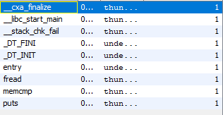

# Description
> there's crypto in here but the challenge is not crypto... 🤔

Files:
* [not-crypto](https://artifacts.picoctf.net/picoMini+by+redpwn/Reverse+Engineering/not-crypto/not-crypto)

# Solution
First, I ran the provided binary and input a random string to see what occurs.
```
$ ./not-crypto
I heard you wanted to bargain for a flag... whatcha got?
ffffffffffffffffffffffffffffffffffffffffffffffffffffffffffffffff
Nope, come back later
```

Got it. We probably need to input the flag. I imported the binary into Ghidra and didn't see a `main` method, which I thought to be a bit odd.



However, we do have `memcmp()`. The program has to compare the user-provided string with the flag at some point, most likely with `memcmp()`, so we can open the binary in GDB and create a breakpoint on the function.
```
gef➤  b memcmp
Breakpoint 1 at 0x1060
```

We can run (with `r`) and input some junk, GDB subsequently hitting the breakpoint. We can see that the RDI register contains something that looks a lot like the start of a flag.
```
$rsi   : 0x00007fffffffd870  →  "xdxdxdlolhahahahaahaahahaahahahaahhahahahahahahahh[...]"
$rdi   : 0x00007fffffffd980  →  "picoCTF{c0mp1l3r_0pt1m1z4t10n_15_pur3_w1z4rdry_but[...]"
```

We can print out the contents of RDI to get the full flag.
```
gef➤  x/s $rdi
0x7fffffffd980: "picoCTF{c0mp1l3r_0pt1m1z4t10n_15_pur3_w1z4rdry_but_n0_pr0bl3m?}\n\346\331\377\377\377\177"
```

Nice!

# Flag
```
picoCTF{c0mp1l3r_0pt1m1z4t10n_15_pur3_w1z4rdry_but_n0_pr0bl3m?}
```